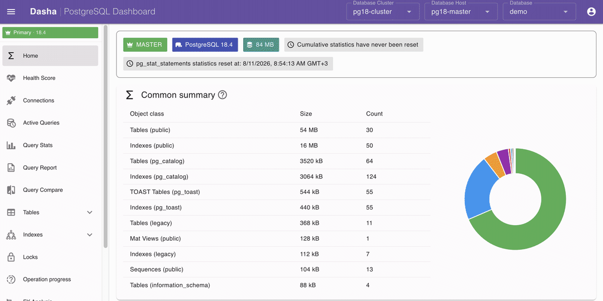

<p align="center">
  
</p>

Дашборд производительности PostgreSQL для анализа состояния кластеров баз данных, выявления проблем и предоставления рекомендаций по оптимизации.

[English version](README.md)

[](https://github.com/dbulashev/dasha/actions/workflows/ci.yaml)
[](https://hub.docker.com/r/dbulashev/dasha-backend)
[](https://hub.docker.com/r/dbulashev/dasha-frontend)


<p align="center">
  
</p>

## Возможности

[Анализ запросов](doc/ru/features.md#анализ-запросов) ·
[Анализ индексов](doc/ru/features.md#анализ-индексов) ·
[Анализ таблиц](doc/ru/features.md#анализ-таблиц) ·
[Анализ внешних ключей](doc/ru/features.md#анализ-внешних-ключей) ·
[Обслуживание и вакуум](doc/ru/features.md#обслуживание-и-вакуум) ·
[Соединения и блокировки](doc/ru/features.md#соединения-и-блокировки) ·
[I/O](doc/ru/features.md#io-pg_stat_io-postgresql-16) ·
[Отслеживание прогресса](doc/ru/features.md#отслеживание-прогресса) ·
[Анализ настроек](doc/ru/features.md#анализ-настроек) ·
[Проверки схемы](doc/ru/features.md#проверки-схемы) ·
[Health Score](doc/ru/features.md#health-score) ·
[Поиск по логам (Yandex Cloud)](doc/ru/features.md#поиск-по-логам-yandex-cloud) ·
[Аутентификация и авторизация](doc/ru/features.md#аутентификация-и-авторизация) ·
[Инфраструктура](doc/ru/features.md#инфраструктура) ·
[Пользовательские настройки](doc/ru/features.md#пользовательские-настройки) ·
[Автоснимки](doc/ru/autosnapshot.md) ·
[MCP-коннектор](doc/ru/mcp.md)

Полный список с подробностями: [doc/ru/features.md](doc/ru/features.md).

## Быстрый старт

Создайте файл `dasha.yaml` (ищется в `.`, `$HOME/.dasha/`, `/etc/dasha/`):

```yaml
clusters:
  - name: production
    username: monitoring_user
    password: secret
    port: 5432
    databases:
      - myapp
    hosts:
      - pg-master.example.com
      - pg-replica-1.example.com
```

Роль, под которой подключается Dasha, должна иметь право подключения к наблюдаемым базам; с `pg_monitor` ей видны и чужие запросы:

```sql
CREATE ROLE monitoring_user LOGIN PASSWORD 'secret';
GRANT pg_monitor TO monitoring_user;
GRANT CONNECT ON DATABASE myapp TO monitoring_user;
```

Без `pg_monitor` в отчёте по запросам и в панелях Top 10 будут видны только запросы самой этой роли.

Запуск на готовых образах:

```bash
cd deploy/compose
# Отредактируйте dasha.yaml под ваши кластеры
docker compose up -d
# Откройте http://localhost:3000
```

Всё остальное — сервис-дискавери, поиск по логам, проверки схемы, аутентификация, хранилище
снимков — опционально и описано в [Конфигурации](doc/ru/configuration.md).

Чтобы посмотреть Dasha на живой нагрузке, `make demo-lab` поднимает несколько кластеров PostgreSQL
с потоковой репликацией, OIDC-провайдер и генератор нагрузки:
[Демо-лаборатория](doc/ru/development.md#демо-лаборатория).

## Документация

| Документ | Содержание |
|---|---|
| [Возможности](doc/ru/features.md) | Полный список возможностей по разделам |
| [Архитектура](doc/ru/architecture.md) | Компоненты, потоки данных, технологический стек |
| [Конфигурация](doc/ru/configuration.md) | `dasha.yaml`, сервис-дискавери, поиск по логам, проверки схемы |
| [Аутентификация](doc/ru/auth.md) | Режимы `none` / `token` / OIDC, RBAC, персональные токены |
| [Снимки](doc/ru/autosnapshot.md) | Хранилище снимков и демон автоснимков |
| [Развёртывание](doc/ru/deployment.md) | Docker Compose, образы, Helm-чарт |
| [MCP-коннектор](doc/ru/mcp.md) | `dasha-mcp` — read-only диагностика для AI-ассистентов |
| [Разработка](doc/ru/development.md) | Локальный запуск, демо-лаборатория, структура проекта, кодогенерация, CI/CD |
| [Модель Health Score](README-health-score.ru.md) | Формула, веса, все правила и пороги |

Английская версия: [doc/en/](doc/en/) — кроме модели Health Score, у неё отдельный файл
в корне: [README-health-score.md](README-health-score.md).

## История изменений

См. [CHANGELOG.ru.md](CHANGELOG.ru.md).

## Authors
* [Dmitry Bulashev](https://dbulashev.github.io/)

## Contributors

* [Anton Glushakov](https://github.com/glushakov)
* [Mikhail Grigorev](https://github.com/cherts)
* [Ilya Lukyanov](mailto:lukyanov1985@gmail.com)
* [Roman Minebaev](https://github.com/minebaev)
* [Rustem Sagdeev](https://github.com/SagdeevRR)

## Сторонние компоненты

SQL для раздела **Проверки схемы** заимствован из проекта [db_verifier](https://github.com/sdblist/db_verifier)
(MIT, © 2024 Nikonov — текст лицензии в файле `LICENSE` проекта) — набора проверок структуры БД для
PostgreSQL. Атрибуция по шаблонам: [backend/internal/query/README.md](backend/internal/query/README.md).

Запрос **дерева блокировок** взят из [postgres_dba](https://github.com/NikolayS/postgres_dba)
(BSD 3-Clause, © 2017 Nikolay Samokhvalov) — `sql/l2_lock_trees.sql`, адаптирован в один запрос
без psql-ветвлений по версии. Текст лицензии:
[backend/internal/query/LICENSE-postgres_dba](backend/internal/query/LICENSE-postgres_dba).

Оценка bloat индексов происходит из [pgsql-bloat-estimation](https://github.com/ioguix/pgsql-bloat-estimation)
(BSD-подобная лицензия PostgreSQL, © 2015-2019 Jehan-Guillaume (ioguix) de Rorthais; текст лицензии —
в файле `LICENSE` проекта).

## Лицензия

[GNU General Public License v3.0](LICENSE)
