# Скриншоты Dasha (RU)

## Главная

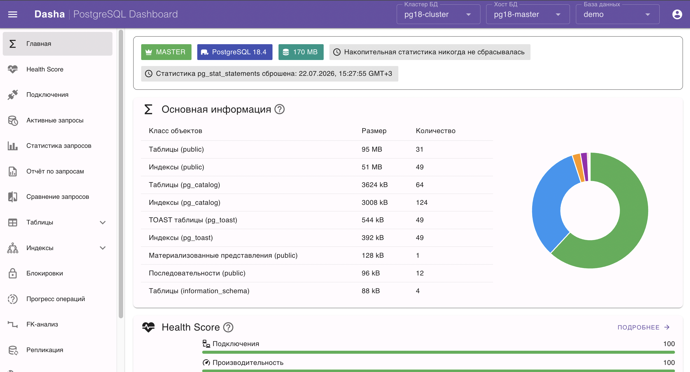

## Запросы и снимки статистики

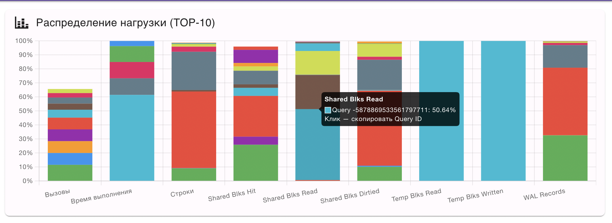

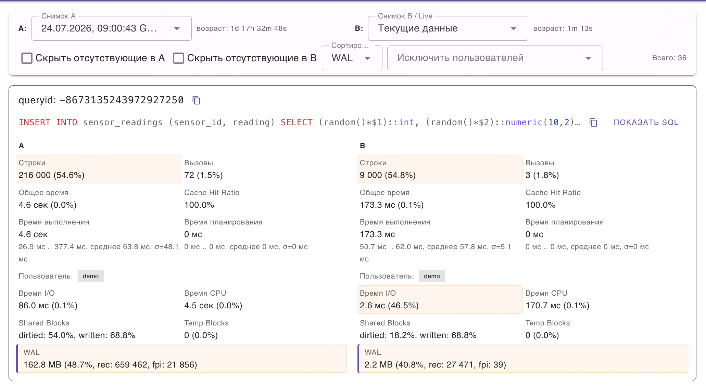

## Индексы и таблицы

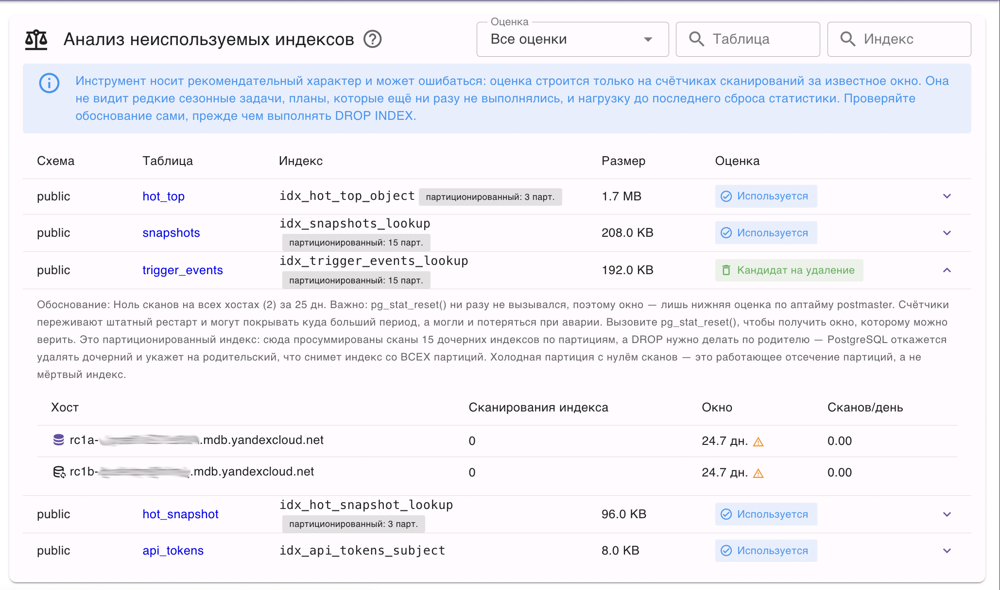

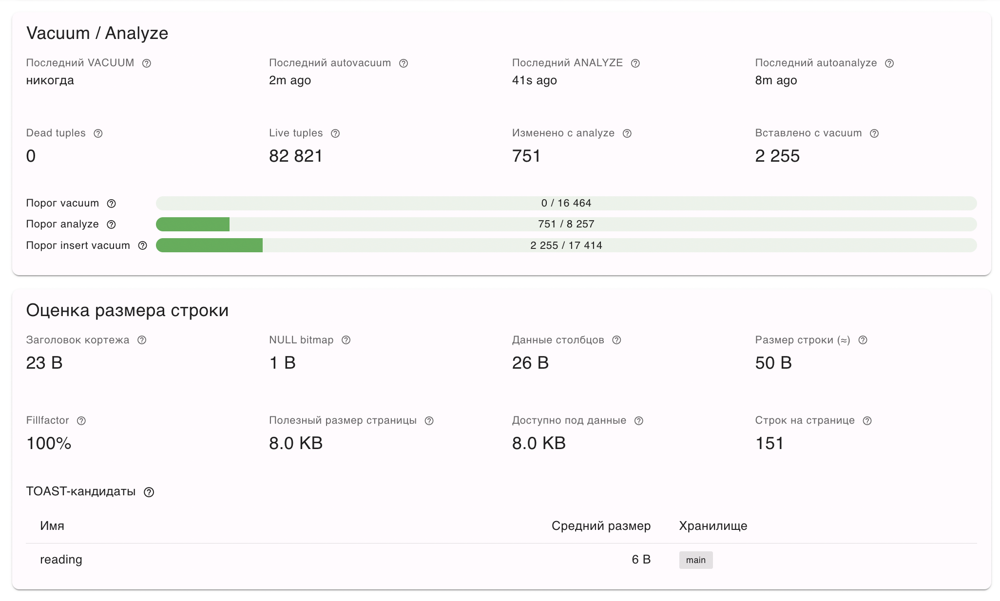

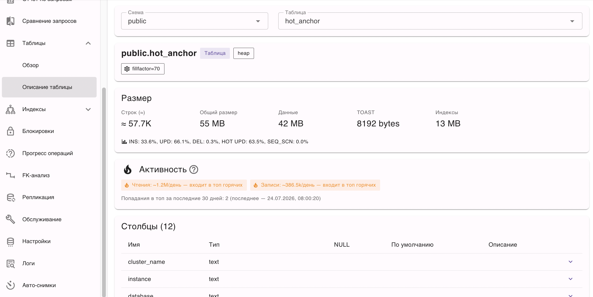

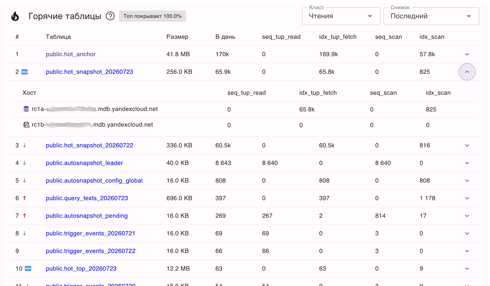

## Обслуживание, соединения, блокировки

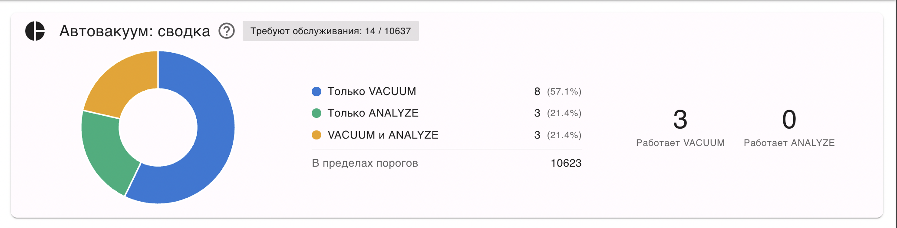

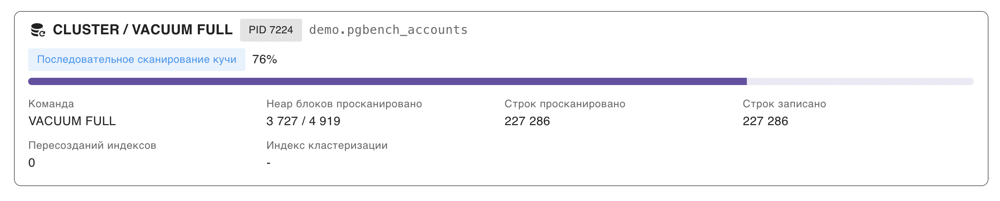

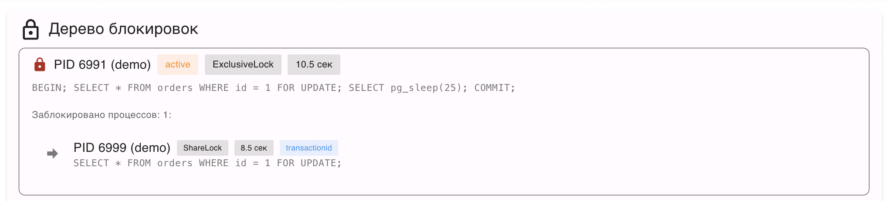

## Health Score

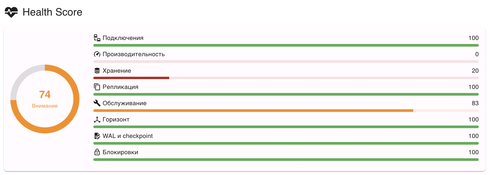

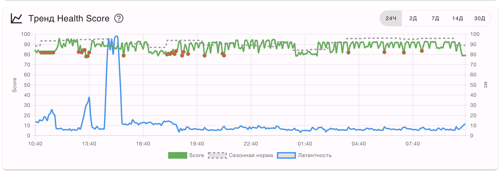

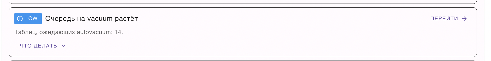

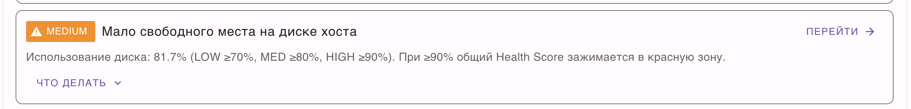

## Логи managed-кластеров

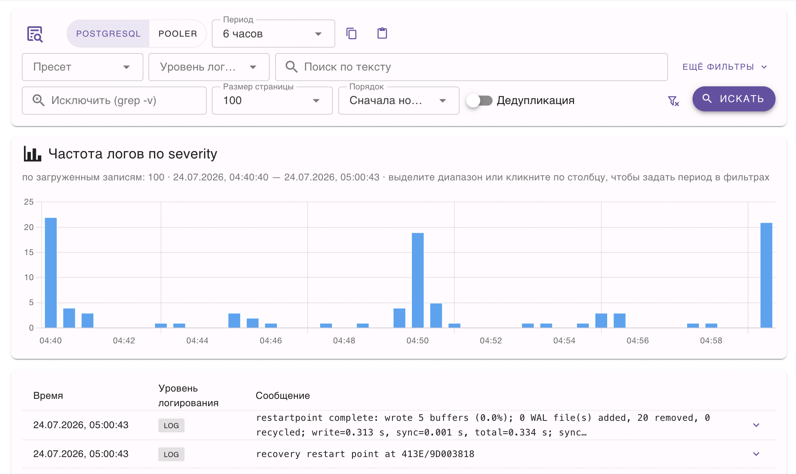

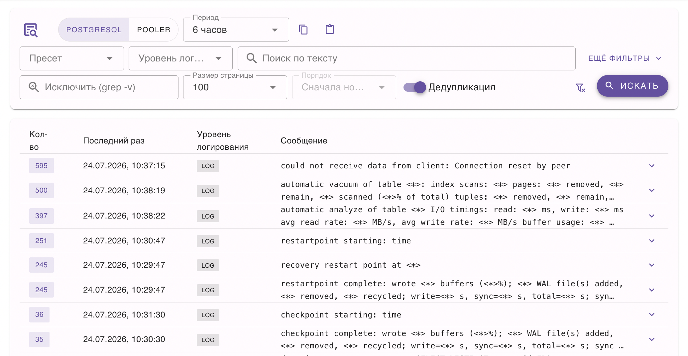
