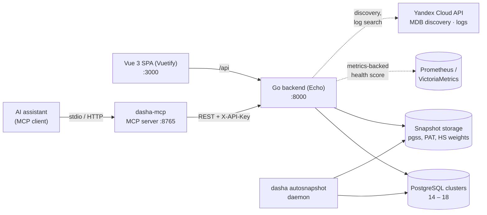

# Architecture

[Русская версия](../ru/architecture.md) · [← README](../../README.md)

**API-first**: the OpenAPI 3.0 spec (`doc/swagger.yaml`) is the single source of truth. Backend stubs and frontend API client are generated from it.

| Layer | Stack |
|-------|-------|
| Frontend | Vue 3, Vuetify 3, Pinia, TanStack Vue Query, vue-i18n, Vite |
| Backend | Go 1.26, Echo v4, pgx v5, Casbin, gorilla/securecookie, coreos/go-oidc, Viper, Cobra, Zap, samber/do |
| Code generation | oapi-codegen (Go server), orval (TypeScript client) |
| Testing | Vitest, Playwright, testcontainers-go (PG 14-18 matrix) |

