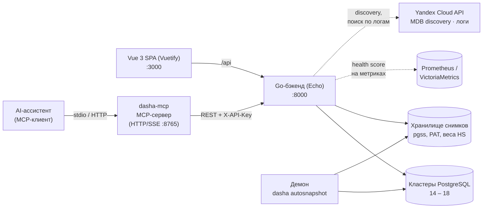

# Архитектура

[English version](../en/architecture.md) · [← README](../../README.ru.md)

**API-first**: спецификация OpenAPI 3.0 (`doc/swagger.yaml`) — единственный источник истины. Серверные заглушки и клиент фронтенда генерируются из неё.

| Слой | Стек |
|------|------|
| Фронтенд | Vue 3, Vuetify 3, Pinia, TanStack Vue Query, vue-i18n, Vite |
| Бэкенд | Go 1.26, Echo v4, pgx v5, Casbin, gorilla/securecookie, coreos/go-oidc, Viper, Cobra, Zap, samber/do |
| Кодогенерация | oapi-codegen (Go-сервер), orval (TypeScript-клиент) |
| Тестирование | Vitest, Playwright, testcontainers-go (матрица PG 14-18) |

